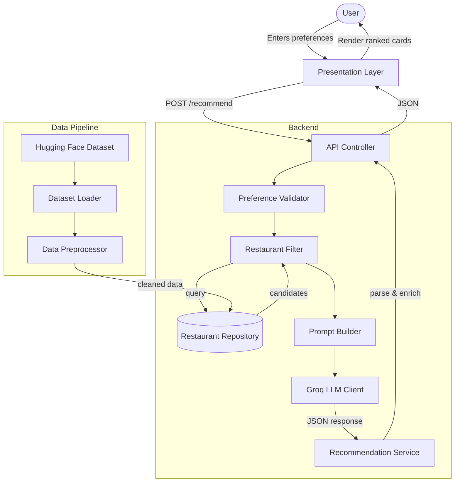
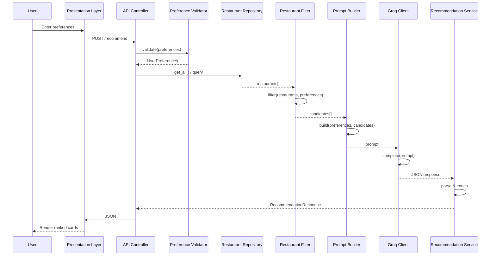
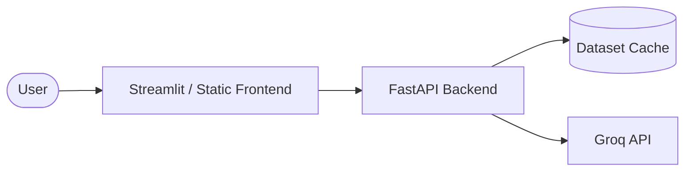

# AI-Powered Restaurant Recommendation System — Architecture

This document defines the detailed system architecture for the Zomato-inspired AI-powered restaurant recommendation service, based on the requirements in [context.md](file:///Users/iamprince/Desktop/Zomato-milestone-1/context.md).

---

## 1. Architecture Goals

| Goal | Description |
|---|---|
| **Separation of concerns** | Data loading, filtering, LLM reasoning, and presentation are isolated modules with clear interfaces. |
| **Deterministic pre-filtering** | Hard constraints (location, budget, rating) are applied before the LLM to reduce token cost and hallucination risk. |
| **Explainability** | Every recommendation includes an LLM-generated rationale tied to user preferences. |
| **Extensibility** | Swap UI frameworks or data sources without rewriting core logic; LLM access is isolated behind a Groq adapter. |
| **Testability** | Pure functions for filtering/ranking prep; mockable LLM adapter for unit tests. |

---

## 2. High-Level Architecture Diagram



---

## 3. Component Architecture

### 3.1 Data Ingestion Layer

**Responsibility:** Load, normalize, and cache the Zomato dataset once at startup (or on first request).

| Component | Role |
|---|---|
| `DatasetLoader` | Fetches `ManikaSaini/zomato-restaurant-recommendation` via `datasets` (Hugging Face). |
| `DataPreprocessor` | Maps raw columns to a canonical schema, handles nulls, normalizes text fields. |
| `RestaurantRepository` | In-memory query interface over the preprocessed dataset. |

#### Canonical Restaurant Schema

```python
Restaurant = {
    "id": str,              # stable identifier (index or dataset id)
    "name": str,
    "location": str,        # city / locality
    "cuisines": list[str],  # e.g. ["Italian", "Continental"]
    "cost_for_two": int,    # numeric cost indicator
    "rating": float,        # e.g. 4.2
    "votes": int,           # optional: popularity signal
    "rest_type": str,       # optional: casual dining, cafe, etc.
}
```

#### Preprocessing Steps

1. Download dataset split (typically `train`).
2. Select and rename relevant columns to the canonical schema.
3. Parse cuisine strings into lists (e.g. `"Italian, Chinese"` → `["Italian", "Chinese"]`).
4. Coerce `rating` and `cost` to numeric types; drop or impute invalid rows.
5. Normalize location strings (trim, title-case, alias map for city names).
6. Derive `budget_tier` from `cost_for_two` using configurable thresholds:

| Tier | Typical `cost_for_two` range (INR) |
|---|---|
| `low` | ≤ 500 |
| `medium` | 501 – 1500 |
| `high` | > 1500 |

> Thresholds should be tuned after inspecting the actual dataset distribution.

#### Caching Strategy

Load once into a pandas `DataFrame` or list of `Restaurant` objects. Persist a local parquet/CSV snapshot to avoid repeated Hugging Face downloads during development.

---

### 3.2 User Input Layer

**Responsibility:** Collect, validate, and normalize user preferences.

#### Input Model

```python
UserPreferences = {
    "location": str,           # required
    "budget": str,             # "low" | "medium" | "high"
    "cuisine": str | None,     # optional primary cuisine
    "min_rating": float,       # e.g. 3.5
    "additional": str | None,  # free-text: "family-friendly, quick service"
}
```

| Component | Role |
|---|---|
| `PreferenceForm` | UI form or CLI prompt collecting fields. |
| `PreferenceValidator` | Enforces required fields, enum values, rating bounds. |
| `PreferenceNormalizer` | Lowercases cuisine, maps city aliases, trims free text. |

#### Validation Rules

- **`location`** — non-empty; must match at least one value in the dataset (or suggest closest matches).
- **`budget`** — one of `low`, `medium`, `high`.
- **`min_rating`** — float in `[0.0, 5.0]`.
- **`cuisine`** — optional; fuzzy match against known cuisine vocabulary extracted from dataset.
- **`additional`** — optional free text passed through to the LLM for soft matching.

---

### 3.3 Integration Layer

**Responsibility:** Apply hard filters, rank candidates heuristically, and assemble the LLM prompt.

This layer sits between structured data and the LLM. It ensures the model only reasons over a bounded, relevant candidate set.

#### 3.3.1 Restaurant Filter

Applies deterministic filters in sequence:

```
all restaurants
  → filter by location (exact or case-insensitive match)
  → filter by budget tier
  → filter by min_rating
  → filter by cuisine (if provided; match if cuisine in restaurant.cuisines)
  → sort by rating desc, then votes desc
  → take top N candidates (default N = 15–20)
```

| Component | Role |
|---|---|
| `RestaurantFilter` | Executes filter pipeline; returns `list[Restaurant]`. |
| `CandidateSelector` | Caps result count and applies tie-breaking. |

> If zero candidates remain, relax constraints in order: `cuisine` → `budget` → `min_rating`, and surface a warning to the user.

#### 3.3.2 Prompt Builder

Constructs a structured prompt containing:

1. **System instructions** — role, output format (JSON), ranking criteria.
2. **User preferences** — serialized `UserPreferences`.
3. **Candidate restaurants** — compact JSON array of filtered restaurants.
4. **Task** — rank top K (e.g. 5), explain each pick, optionally summarize.

**Design principles:**

- Require JSON output from the LLM for reliable parsing.
- Include restaurant `id` in candidates so explanations map back to structured data.
- Instruct the model to only recommend from the provided list (no fabrication).
- Pass `additional` preferences as soft signals the LLM may use in ranking/explanation.

**Example prompt structure (conceptual):**

```
[System]
You are a restaurant recommendation assistant for Indian cities.
Rank restaurants from the CANDIDATES list only. Return valid JSON.

[User Preferences]
{ location, budget, cuisine, min_rating, additional }

[Candidates]
[ { id, name, location, cuisines, cost_for_two, rating }, ... ]

[Task]
Return top 5 restaurants as JSON:
{
  "summary": "...",
  "recommendations": [
    {
      "id": "...",
      "rank": 1,
      "explanation": "..."
    }
  ]
}
```

---

### 3.4 Recommendation Engine (LLM Layer)

**Responsibility:** Invoke the LLM, handle retries, parse and validate the response, merge with structured data.

| Component | Role |
|---|---|
| `LLMClient` | Thin adapter over the Groq API via the official `groq` Python SDK. |
| `RecommendationService` | Orchestrates prompt → LLM → parse → enrich. |
| `ResponseParser` | Parses JSON; validates schema; handles malformed output. |
| `RecommendationEnricher` | Joins LLM ranks/explanations with full restaurant records. |

#### Output Model

```python
Recommendation = {
    "rank": int,
    "name": str,
    "cuisine": str,           # joined cuisine string for display
    "rating": float,
    "estimated_cost": int,    # cost_for_two
    "explanation": str,       # LLM-generated
}

RecommendationResponse = {
    "summary": str | None,
    "recommendations": list[Recommendation],
    "metadata": {
        "candidates_considered": int,
        "filters_applied": dict,
        "model": str,
    }
}
```

#### Reliability Patterns

| Pattern | Purpose |
|---|---|
| Structured output / JSON mode | Reduce parse failures. |
| Retry with temperature reduction | Recover from invalid JSON. |
| Fallback ranking | If LLM fails, return heuristic top-K by rating with a generic explanation. |
| Idempotency | Same preferences + same dataset snapshot → reproducible candidate set. |

**LLM is _not_ used for:**

- Loading data
- Hard filtering by location/budget/rating
- Inventing restaurants not in the candidate list

#### Groq Integration

Groq is the sole LLM provider for this project. The `LLMClient` wraps Groq's chat completions API and is configured via environment variables.

| Setting | Default | Notes |
|---|---|---|
| SDK | `groq` | Official Python client (`pip install groq`). |
| API key | `GROQ_API_KEY` | Required; set in `.env`, never committed. |
| Model | `llama-3.3-70b-versatile` | Strong reasoning for ranking and explanations. |
| Fallback model | `llama-3.1-8b-instant` | Optional faster/cheaper alternative for dev. |
| Temperature | `0.3` | Low enough for consistent JSON; retry with `0.1` on parse failure. |

**Client usage (conceptual):**

```python
from groq import Groq

client = Groq(api_key=settings.GROQ_API_KEY)

response = client.chat.completions.create(
    model=settings.GROQ_MODEL,
    messages=[
        {"role": "system", "content": system_prompt},
        {"role": "user", "content": user_prompt},
    ],
    temperature=settings.GROQ_TEMPERATURE,
    response_format={"type": "json_object"},  # when supported by model
)
```

**Groq-specific considerations:**

- Groq offers very low latency inference — suitable for interactive UI feedback.
- Enforce JSON output in the prompt; use `response_format={"type": "json_object"}` where the selected model supports it.
- Handle Groq rate limits (429) with exponential backoff before falling back to heuristic ranking.
- Log model ID and latency per request; Groq responses include token usage in `response.usage`.

---

### 3.5 Output Display Layer

**Responsibility:** Render recommendations in a clear, scannable format.

| Component | Role |
|---|---|
| `RecommendationPresenter` | Formats `RecommendationResponse` for UI or CLI. |
| `ResultsView` | Cards/table showing name, cuisine, rating, cost, explanation. |
| `SummaryBanner` | Optional LLM summary at the top. |

**Display requirements (from context):**

Each result card/row must show:
- Restaurant Name
- Cuisine
- Rating
- Estimated Cost
- AI-generated explanation

**UX considerations:**

- Show applied filters (location, budget, etc.) above results.
- Display "no results" state with suggestions to broaden filters.
- Show loading state while dataset loads / LLM responds.
- Rank badge (1, 2, 3…) for quick scanning.

---

## 4. Request Flow (Sequence Diagram)



---

## 5. Proposed Module Structure

Recommended layout for a Python implementation:

```
zomato-milestone1/
├── docs/
│   ├── context.md
│   ├── architecture.md
│   └── problemStatement.txt
├── src/
│   ├── __init__.py
│   ├── main.py                    # entry point (CLI or app bootstrap)
│   ├── config.py                  # env vars, budget thresholds, top-K
│   ├── models/
│   │   ├── restaurant.py          # Restaurant dataclass
│   │   ├── preferences.py         # UserPreferences dataclass
│   │   └── recommendation.py      # Recommendation, RecommendationResponse
│   ├── data/
│   │   ├── loader.py              # Hugging Face dataset loader
│   │   ├── preprocessor.py        # normalization & schema mapping
│   │   └── repository.py          # in-memory query interface
│   ├── services/
│   │   ├── filter.py              # RestaurantFilter
│   │   ├── prompt_builder.py      # PromptBuilder
│   │   ├── llm_client.py          # Groq API adapter
│   │   └── recommendation.py      # RecommendationService orchestrator
│   ├── api/
│   │   ├── routes.py              # FastAPI routes (optional)
│   │   └── schemas.py             # request/response Pydantic models
│   └── ui/
│       ├── cli.py                 # terminal interface
│       └── streamlit_app.py       # or Gradio web UI (optional)
├── tests/
│   ├── test_filter.py
│   ├── test_preprocessor.py
│   └── test_recommendation.py
├── data/                          # cached parquet/csv (gitignored)
├── .env.example                   # GROQ_API_KEY and model config
├── requirements.txt
└── README.md
```

---

## 6. Technology Stack (Recommended)

| Layer | Technology | Rationale |
|---|---|---|
| Language | Python 3.11+ | Strong ecosystem for data + LLM integration. |
| Dataset | `datasets` (Hugging Face) | Direct access to the specified dataset. |
| Data processing | `pandas` | Filtering, normalization, caching. |
| LLM | Groq (`llama-3.3-70b-versatile`) | Fast, low-latency inference for ranking + explanation tasks. |
| LLM SDK | `groq` | Official Groq Python client for chat completions. |
| API (optional) | FastAPI | Lightweight async REST for frontend decoupling. |
| UI (optional) | Streamlit or Gradio | Rapid prototyping of preference form + results. |
| Config | `pydantic-settings` + `.env` | Typed config and secret management. |
| Testing | `pytest` | Unit tests for filter, parser, preprocessor. |

---

## 7. API Design (Optional REST Layer)

If exposing a backend API:

### `POST /api/v1/recommend`

**Request:**

```json
{
  "location": "Bangalore",
  "budget": "medium",
  "cuisine": "Italian",
  "min_rating": 4.0,
  "additional": "family-friendly, outdoor seating"
}
```

**Response:**

```json
{
  "summary": "Based on your preference for Italian cuisine in Bangalore with a medium budget...",
  "recommendations": [
    {
      "rank": 1,
      "name": "Example Ristorante",
      "cuisine": "Italian, Continental",
      "rating": 4.5,
      "estimated_cost": 1200,
      "explanation": "Highly rated Italian spot within your budget, known for family-friendly ambiance."
    }
  ],
  "metadata": {
    "candidates_considered": 18,
    "filters_applied": {
      "location": "Bangalore",
      "budget": "medium",
      "min_rating": 4.0,
      "cuisine": "Italian"
    },
    "model": "llama-3.3-70b-versatile"
  }
}
```

### `GET /api/v1/health`

Returns service status and whether the dataset is loaded.

### `GET /api/v1/locations`

Returns distinct locations from the dataset (populates UI dropdowns).

### `GET /api/v1/cuisines`

Returns distinct cuisines extracted from the dataset.

---

## 8. Data Flow Summary

```
Hugging Face Dataset
        │
        ▼
  [Load & Preprocess] ──► RestaurantRepository (cached)
                                │
User Preferences ──► [Validate] ──► [Filter candidates]
                                          │
                                          ▼
                                   [Build LLM Prompt]
                                          │
                                          ▼
                                    [LLM Rank + Explain]
                                          │
                                          ▼
                                   [Parse & Enrich]
                                          │
                                          ▼
                              RecommendationResponse ──► UI
```

---

## 9. Cross-Cutting Concerns

### 9.1 Configuration

Centralize in `config.py`:

- `HF_DATASET_NAME`
- `BUDGET_THRESHOLDS`
- `MAX_CANDIDATES_FOR_LLM`
- `TOP_K_RECOMMENDATIONS`
- `GROQ_MODEL` (default: `llama-3.3-70b-versatile`)
- `GROQ_API_KEY`
- `GROQ_TEMPERATURE`
- `DATA_CACHE_PATH`

### 9.2 Error Handling

| Scenario | Behavior |
|---|---|
| Dataset download fails | Retry with backoff; show clear error in UI. |
| No restaurants match filters | Relax constraints or prompt user to adjust input. |
| LLM returns invalid JSON | Retry once; fallback to heuristic ranking. |
| LLM timeout / Groq 429 rate limit | Retry with backoff; then return heuristic top-K with note that AI explanation is unavailable. |
| Unknown location | Suggest valid locations from dataset. |

### 9.3 Logging & Observability

- Log filter counts (input size → candidate size).
- Log LLM latency and token usage.
- Do not log full prompts containing API keys.
- Optional: trace ID per recommendation request.

### 9.4 Security

- Store API keys in environment variables, never in source control.
- Validate and sanitize all user inputs.
- Rate-limit API endpoints if deployed publicly.

---

## 10. Deployment Topology

**Development (local):**

```
Developer Machine
├── Python app (Streamlit / FastAPI + CLI)
├── Cached dataset in ./data/
└── Groq API (cloud)
```

**Minimal production:**



- Pre-load dataset at container startup.
- Single-stateless API instance is sufficient for milestone scope.
- Scale horizontally later by sharing a read-only dataset snapshot.

---

## 11. Testing Strategy

| Test type | Scope | Example |
|---|---|---|
| Unit | `RestaurantFilter` | Location + budget + rating filters return expected subset. |
| Unit | `Preprocessor` | Cuisine string parsing, numeric coercion. |
| Unit | `ResponseParser` | Valid/invalid LLM JSON handling. |
| Integration | `RecommendationService` | Mock LLM returns fixed JSON; verify enriched output. |
| Snapshot | `PromptBuilder` | Prompt contains all candidates and preference fields. |

Use a frozen subset of the dataset (10–20 rows) in test fixtures for deterministic tests.

---

## 12. Implementation Phases

| Phase | Deliverable |
|---|---|
| **Phase 1 — Data** | Load Hugging Face dataset, preprocess, cache, expose repository. |
| **Phase 2 — Filter** | Implement preference validation and deterministic filtering. |
| **Phase 3 — LLM** | Prompt builder, LLM client, response parser, enricher. |
| **Phase 4 — UI** | CLI or Streamlit form + results display. |
| **Phase 5 — Hardening** | Error handling, fallback ranking, tests, README. |

---

## 13. Architecture Decisions

| Decision | Choice | Alternatives considered |
|---|---|---|
| LLM provider | Groq (`llama-3.3-70b-versatile`) | OpenAI, Anthropic, local models |
| Pre-filter before LLM | Yes — hard filters in code | Let LLM filter entire dataset (expensive, unreliable) |
| LLM output format | Structured JSON | Free-form text (harder to parse) |
| Data storage | In-memory DataFrame | Database (unnecessary for read-only milestone dataset) |
| Ranking split | Heuristic shortlist + LLM final rank | Pure LLM or pure heuristic |
| UI approach | Streamlit for speed | React SPA (more effort for milestone 1) |

---

## 14. Related Documents

- [context.md](file:///Users/iamprince/Desktop/Zomato-milestone-1/context.md) — product requirements and workflow
- [problemStatement.txt](file:///Users/iamprince/Desktop/Zomato-milestone-1/problemStatement.txt) — original problem statement
