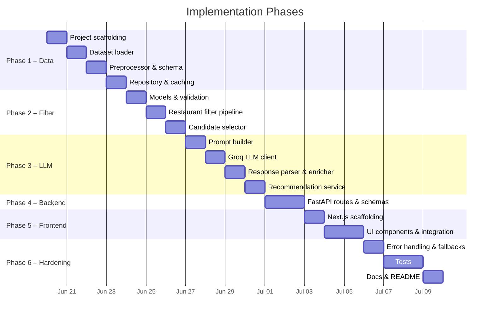

# AI-Powered Restaurant Recommendation System — Phase-Wise Implementation Plan

> Derived from [architecture.md](file:///Users/iamprince/Desktop/Zomato-milestone-1/architecture.md) and [context.md](file:///Users/iamprince/Desktop/Zomato-milestone-1/context.md)

---

## Overview

This plan breaks the project into **5 sequential phases**, each producing a testable, self-contained increment. Dependencies flow forward — every phase builds on the artifacts of the previous one.



---

## Project Scaffolding (Pre-Phase)

Create the directory structure and install dependencies before any coding begins.

### Target Structure

```
zomato-milestone1/
├── docs/
│   ├── context.md
│   ├── architecture.md
│   └── problemStatement.txt
├── src/
│   ├── __init__.py
│   ├── main.py
│   ├── config.py
│   ├── models/
│   │   ├── __init__.py
│   │   ├── restaurant.py
│   │   ├── preferences.py
│   │   └── recommendation.py
│   ├── data/
│   │   ├── __init__.py
│   │   ├── loader.py
│   │   ├── preprocessor.py
│   │   └── repository.py
│   ├── services/
│   │   ├── __init__.py
│   │   ├── filter.py
│   │   ├── prompt_builder.py
│   │   ├── llm_client.py
│   │   └── recommendation.py
│   └── api/
│       ├── __init__.py
│       ├── routes.py
│       └── schemas.py
├── frontend/                   # Next.js / React application
│   ├── src/
│   │   ├── app/
│   │   └── components/
│   ├── package.json
│   └── tailwind.config.ts
├── tests/
│   ├── __init__.py
│   ├── test_filter.py
│   ├── test_preprocessor.py
│   └── test_recommendation.py
├── data/                       # cached parquet/csv (gitignored)
├── .env.example
├── .gitignore
├── requirements.txt
└── README.md
```

### `requirements.txt`

```
datasets
pandas
groq
python-dotenv
pydantic
pydantic-settings
fastapi
uvicorn
streamlit
pytest
```

### `.env.example`

```
GROQ_API_KEY=your_api_key_here
GROQ_MODEL=llama-3.3-70b-versatile
GROQ_TEMPERATURE=0.3
HF_DATASET_NAME=ManikaSaini/zomato-restaurant-recommendation
DATA_CACHE_PATH=./data
MAX_CANDIDATES_FOR_LLM=15
TOP_K_RECOMMENDATIONS=5
```

### Acceptance Criteria

- [ ] All directories and `__init__.py` files exist
- [ ] `pip install -r requirements.txt` succeeds
- [ ] `.gitignore` covers `data/`, `.env`, `__pycache__/`

---

## Phase 1 — Data Ingestion & Repository

> **Goal:** Load the Hugging Face dataset, preprocess it to a canonical schema, and expose a queryable in-memory repository with local caching.

### 1.1 Configuration — `src/config.py`

| Item | Detail |
|---|---|
| **What** | Centralized settings class using `pydantic-settings` |
| **Key fields** | `HF_DATASET_NAME`, `BUDGET_THRESHOLDS` (dict), `MAX_CANDIDATES_FOR_LLM`, `TOP_K_RECOMMENDATIONS`, `GROQ_API_KEY`, `GROQ_MODEL`, `GROQ_TEMPERATURE`, `DATA_CACHE_PATH` |
| **Source** | `.env` file + environment variables |

```python
# Conceptual
class Settings(BaseSettings):
    hf_dataset_name: str = "ManikaSaini/zomato-restaurant-recommendation"
    budget_thresholds: dict = {"low": 500, "medium": 1500}
    groq_api_key: str
    groq_model: str = "llama-3.3-70b-versatile"
    groq_temperature: float = 0.3
    data_cache_path: str = "./data"
    max_candidates: int = 15
    top_k: int = 5

    class Config:
        env_file = ".env"
```

---

### 1.2 Restaurant Model — `src/models/restaurant.py`

| Item | Detail |
|---|---|
| **What** | `Restaurant` dataclass / Pydantic model matching the canonical schema |
| **Fields** | `id`, `name`, `location`, `cuisines: list[str]`, `cost_for_two: int`, `rating: float`, `votes: int`, `rest_type: str`, `budget_tier: str` |

---

### 1.3 Dataset Loader — `src/data/loader.py`

| Item | Detail |
|---|---|
| **What** | `DatasetLoader` class |
| **Behavior** | Fetches `ManikaSaini/zomato-restaurant-recommendation` via the `datasets` library (train split). Returns raw rows. |
| **Caching** | Check for local parquet/CSV at `DATA_CACHE_PATH` first; skip HF download if present. |

**Steps:**
1. Check if cached file exists at `{DATA_CACHE_PATH}/restaurants.parquet`
2. If not, call `datasets.load_dataset(HF_DATASET_NAME, split="train")`
3. Convert to `pandas.DataFrame`
4. Save to cache path
5. Return DataFrame

---

### 1.4 Data Preprocessor — `src/data/preprocessor.py`

| Item | Detail |
|---|---|
| **What** | `DataPreprocessor` class |
| **Input** | Raw DataFrame from loader |
| **Output** | Cleaned DataFrame with canonical schema columns |

**Preprocessing pipeline:**

1. **Select & rename columns** to canonical schema names
2. **Parse cuisines** — split comma-separated strings into `list[str]` (e.g., `"Italian, Chinese"` → `["Italian", "Chinese"]`)
3. **Coerce types** — `rating` → `float`, `cost_for_two` → `int`; drop rows with invalid/unparseable values
4. **Normalize location** — `str.strip().title()`, apply alias map (e.g., `"Bengaluru"` → `"Bangalore"`)
5. **Derive `budget_tier`** from `cost_for_two`:
   - `≤ 500` → `"low"`
   - `501–1500` → `"medium"`
   - `> 1500` → `"high"`
6. **Assign stable `id`** — use DataFrame index or dataset row index as string

---

### 1.5 Restaurant Repository — `src/data/repository.py`

| Item | Detail |
|---|---|
| **What** | `RestaurantRepository` — in-memory query interface |
| **Storage** | Holds preprocessed DataFrame (or `list[Restaurant]`) |
| **Methods** | `get_all()`, `get_locations()`, `get_cuisines()`, `filter_by(**kwargs)` |
| **Initialization** | Wired to `DatasetLoader` → `DataPreprocessor` on first access (lazy or eager at startup) |

---

### Phase 1 Acceptance Criteria

- [ ] `DatasetLoader` downloads and caches the dataset successfully
- [ ] `DataPreprocessor` outputs a DataFrame matching the canonical schema with zero null values in required fields
- [ ] Cuisine strings are correctly split into lists
- [ ] Budget tiers are correctly assigned
- [ ] `RestaurantRepository.get_all()` returns >1000 records
- [ ] `get_locations()` and `get_cuisines()` return distinct sorted lists
- [ ] Subsequent runs use the cached file and skip the HF download

### Phase 1 Verification

```bash
# Quick smoke test via Python REPL
python -c "
from src.data.loader import DatasetLoader
from src.data.preprocessor import DataPreprocessor
from src.data.repository import RestaurantRepository

loader = DatasetLoader()
df = loader.load()
preprocessor = DataPreprocessor()
clean_df = preprocessor.preprocess(df)
repo = RestaurantRepository(clean_df)

print(f'Total restaurants: {len(repo.get_all())}')
print(f'Locations: {repo.get_locations()[:10]}')
print(f'Cuisines: {repo.get_cuisines()[:10]}')
print(f'Sample: {repo.get_all()[0]}')
"
```

---

## Phase 2 — User Input & Deterministic Filtering

> **Goal:** Define the user preference model, validate inputs, and implement the deterministic filter pipeline that produces a bounded candidate set for the LLM.

### 2.1 Preferences Model — `src/models/preferences.py`

| Field | Type | Required | Validation |
|---|---|---|---|
| `location` | `str` | ✅ | Non-empty; must exist in dataset locations (or suggest closest) |
| `budget` | `str` | ✅ | One of `"low"`, `"medium"`, `"high"` |
| `cuisine` | `str \| None` | ❌ | Fuzzy match against known cuisine vocabulary |
| `min_rating` | `float` | ✅ | `0.0 ≤ val ≤ 5.0` |
| `additional` | `str \| None` | ❌ | Free text; passed to LLM as soft signal |

**Components:**
- `PreferenceValidator` — enforces required fields, enum checks, rating bounds
- `PreferenceNormalizer` — lowercases cuisine, maps city aliases, trims text

---

### 2.2 Restaurant Filter — `src/services/filter.py`

Implements the deterministic filter pipeline in sequence:

```
all restaurants
  → filter by location (case-insensitive match)
  → filter by budget_tier
  → filter by min_rating (rating >= min_rating)
  → filter by cuisine (if provided; cuisine in restaurant.cuisines)
  → sort by rating DESC, then votes DESC
  → take top N candidates (N = MAX_CANDIDATES_FOR_LLM, default 15)
```

**Key classes:**
- `RestaurantFilter` — executes the filter pipeline, returns `list[Restaurant]`
- `CandidateSelector` — caps result count and applies tie-breaking

> [!IMPORTANT]
> **Constraint Relaxation:** If zero candidates remain after filtering, relax constraints in this order: `cuisine` → `budget` → `min_rating`, and surface a warning to the user indicating which constraint was relaxed.

---

### Phase 2 Acceptance Criteria

- [ ] `PreferenceValidator` rejects invalid inputs (empty location, invalid budget, rating out of bounds)
- [ ] `PreferenceValidator` accepts valid inputs and returns a normalized `UserPreferences` object
- [ ] `RestaurantFilter` correctly applies all four filter stages in sequence
- [ ] Filter output is sorted by rating DESC, then votes DESC
- [ ] Result is capped at `MAX_CANDIDATES_FOR_LLM`
- [ ] Constraint relaxation works correctly when no candidates match
- [ ] Relaxation warning is surfaced

### Phase 2 Verification

```bash
python -c "
from src.models.preferences import UserPreferences
from src.services.filter import RestaurantFilter
from src.data.repository import RestaurantRepository
# ... load repo ...

prefs = UserPreferences(location='Bangalore', budget='medium', cuisine='Italian', min_rating=4.0)
candidates = RestaurantFilter(repo).filter(prefs)
print(f'Candidates: {len(candidates)}')
for c in candidates[:3]:
    print(f'  {c.name} | {c.rating} | {c.cuisines}')
"
```

---

## Phase 3 — LLM Integration & Recommendation Engine

> **Goal:** Build the prompt, call the Groq API, parse the structured JSON response, and enrich it with full restaurant data to produce the final `RecommendationResponse`.

### 3.1 Prompt Builder — `src/services/prompt_builder.py`

Constructs a structured prompt with four sections:

| Section | Content |
|---|---|
| **System** | Role definition, output format (JSON), ranking criteria, "only recommend from CANDIDATES list" |
| **User Preferences** | Serialized `UserPreferences` dict |
| **Candidates** | Compact JSON array of filtered restaurants (include `id`, `name`, `location`, `cuisines`, `cost_for_two`, `rating`) |
| **Task** | "Rank top K restaurants. Return valid JSON with `summary` and `recommendations` array." |

**Design rules:**
- Require JSON output from the LLM
- Include `id` in candidates so explanations map back to structured data
- Instruct the model to **only** recommend from the provided list
- Pass `additional` preferences as soft signals

---

### 3.2 LLM Client — `src/services/llm_client.py`

| Item | Detail |
|---|---|
| **What** | `LLMClient` — thin adapter over the Groq Python SDK |
| **SDK** | `groq` (official Python client) |
| **Config** | `GROQ_API_KEY`, `GROQ_MODEL` (`llama-3.3-70b-versatile`), `GROQ_TEMPERATURE` (0.3) |
| **Method** | `complete(system_prompt: str, user_prompt: str) -> str` |

**Reliability patterns:**
- Use `response_format={"type": "json_object"}` when supported
- **Retry** — on invalid JSON, retry once with temperature reduced to `0.1`
- **Rate limit** — handle Groq 429 with exponential backoff
- **Fallback** — if all retries fail, raise an exception caught by the service layer
- **Logging** — log model ID, latency, and token usage per request

---

### 3.3 Response Parser — `src/services/recommendation.py` (part of)

| Item | Detail |
|---|---|
| **What** | `ResponseParser` class |
| **Input** | Raw JSON string from LLM |
| **Output** | Parsed dict matching `RecommendationResponse` schema |
| **Error handling** | Validate schema; handle malformed JSON; raise `ParseError` |

---

### 3.4 Recommendation Enricher — `src/services/recommendation.py` (part of)

| Item | Detail |
|---|---|
| **What** | `RecommendationEnricher` class |
| **Behavior** | Joins LLM-returned ranks and explanations with full `Restaurant` records from the repository |
| **Output** | List of `Recommendation` objects with all display fields |

---

### 3.5 Recommendation Model — `src/models/recommendation.py`

```python
Recommendation = {
    "rank": int,
    "name": str,
    "cuisine": str,          # joined cuisine string for display
    "rating": float,
    "estimated_cost": int,   # cost_for_two
    "explanation": str,      # LLM-generated
}

RecommendationResponse = {
    "summary": str | None,
    "recommendations": list[Recommendation],
    "metadata": {
        "candidates_considered": int,
        "filters_applied": dict,
        "model": str,
    }
}
```

---

### 3.6 Recommendation Service — `src/services/recommendation.py`

**Orchestrator** that wires everything together:

```
UserPreferences
  → RestaurantFilter.filter(prefs)        → candidates
  → PromptBuilder.build(prefs, candidates) → prompt
  → LLMClient.complete(prompt)            → raw JSON
  → ResponseParser.parse(raw)             → parsed response
  → RecommendationEnricher.enrich(parsed, candidates) → RecommendationResponse
```

**Fallback path:** If LLM fails after retries, return heuristic top-K by rating with a generic explanation: *"Ranked by rating and popularity. AI explanation unavailable."*

---

### Phase 3 Acceptance Criteria

- [ ] `PromptBuilder` generates a well-structured prompt containing all required sections
- [ ] Prompt includes restaurant `id` for traceability
- [ ] `LLMClient` successfully calls Groq and returns a response
- [ ] `ResponseParser` correctly parses valid LLM JSON output
- [ ] `ResponseParser` handles malformed JSON gracefully
- [ ] `RecommendationEnricher` correctly joins LLM output with full restaurant records
- [ ] `RecommendationService` end-to-end produces a valid `RecommendationResponse`
- [ ] Fallback ranking works when LLM is unavailable
- [ ] Token usage and latency are logged

### Phase 3 Verification

```bash
# End-to-end test (requires valid GROQ_API_KEY in .env)
python -c "
from src.services.recommendation import RecommendationService
from src.models.preferences import UserPreferences

service = RecommendationService()
prefs = UserPreferences(
    location='Bangalore',
    budget='medium',
    cuisine='Italian',
    min_rating=4.0,
    additional='family-friendly'
)
result = service.recommend(prefs)
print(f'Summary: {result.summary}')
for rec in result.recommendations:
    print(f'  #{rec.rank} {rec.name} ({rec.rating}) — {rec.explanation[:80]}...')
"
```

---

## Phase 4 — Backend API Layer

> **Goal:** Build a robust backend REST API using FastAPI to serve the frontend application.

### 4.1 FastAPI REST API — `src/api/routes.py`

| Endpoint | Method | Description |
|---|---|---|
| `/api/v1/recommend` | `POST` | Accepts `UserPreferences` JSON, returns `RecommendationResponse` |
| `/api/v1/health` | `GET` | Service status + dataset loaded flag |
| `/api/v1/locations` | `GET` | Distinct locations from dataset |
| `/api/v1/cuisines` | `GET` | Distinct cuisines from dataset |

**Request/Response schemas** in `src/api/schemas.py` using Pydantic models. Ensure CORS is correctly configured to allow requests from the frontend.

### 4.2 Entry Point — `src/main.py`

```python
# Launch FastAPI with uvicorn
# python -m src.main
```

### Phase 4 Acceptance Criteria

- [ ] FastAPI app launches without errors
- [ ] `/api/v1/locations` and `/api/v1/cuisines` return data correctly
- [ ] `/api/v1/recommend` accepts payload and returns LLM-enriched recommendations
- [ ] CORS middleware is configured

### Phase 4 Verification

```bash
# Launch API
uvicorn src.api.routes:app --reload

# Test endpoint
curl -X POST http://localhost:8000/api/v1/recommend \
  -H "Content-Type: application/json" \
  -d '{"location":"Bangalore","budget":"medium","cuisine":"Italian","min_rating":4.0}'
```

---

## Phase 5 — Frontend Development

> **Goal:** Build a premium, high-quality modern frontend application (e.g., using Next.js or Vite + React) with rich aesthetics, dynamic animations, and an intuitive UX.

### 5.1 Project Setup & Configuration

- Initialize a Next.js (or Vite + React) project in `frontend/`.
- Setup a modern styling solution (Vanilla CSS, CSS Modules, or TailwindCSS if preferred by the user).
- **Design Aesthetic Requirements:**
  - Curated, harmonious color palettes (e.g., sleek dark mode or vibrant, rich colors).
  - Modern typography (e.g., Inter, Roboto, Outfit).
  - Micro-animations, hover states, and smooth transitions.
  - Glassmorphism effects or subtle gradients.

### 5.2 UI Components

- **Search/Preference Form:** Dropdowns for locations and cuisines (fetching from backend API), sliders for ratings, radio buttons for budget.
- **Loading State:** A skeleton loader or premium spinner with engaging text while the LLM processes.
- **Results Display:** Card-based UI showing the restaurant details, ranks, rating badges, cost, and the LLM's customized explanation.
- **Empty States:** Beautiful empty states when no results are found or before a search is initiated.

### Phase 5 Acceptance Criteria

- [ ] Frontend successfully runs locally and connects to the FastAPI backend.
- [ ] The design feels highly premium and modern, adhering to the requested aesthetics.
- [ ] Location and cuisine dropdowns successfully populate via API calls.
- [ ] The recommendation flow works end-to-end through the UI.

### Phase 5 Verification

```bash
cd frontend
npm install
npm run dev
# Then open http://localhost:3000 to interact with the high-quality UI
```

---

## Phase 6 — Hardening, Testing & Polish

> **Goal:** Add robust error handling, fallback paths, comprehensive tests, logging, and documentation to make the system production-ready.

### 5.1 Error Handling & Fallbacks

| Scenario | Behavior |
|---|---|
| Dataset download fails | Retry with backoff (3 attempts); show clear error in UI |
| No restaurants match filters | Relax constraints in order: `cuisine` → `budget` → `min_rating`; show warning |
| LLM returns invalid JSON | Retry once with temperature `0.1`; fallback to heuristic ranking |
| LLM timeout / Groq 429 | Exponential backoff; return heuristic top-K with note |
| Unknown location | Suggest valid locations from dataset (fuzzy match) |

---

### 5.2 Logging & Observability

- Use Python `logging` module
- Log filter pipeline counts: `input_size → candidate_size`
- Log LLM latency (`response.usage`) and token consumption
- **Never** log full prompts containing API keys
- Optional: add a `trace_id` per recommendation request

---

### 5.3 Security

- [ ] API keys stored only in `.env`, never committed
- [ ] All user inputs validated and sanitized
- [ ] Rate limiting on API endpoints if deployed publicly
- [ ] `.env` and `data/` in `.gitignore`

---

### 5.4 Test Suite

| Test File | Type | Coverage |
|---|---|---|
| `tests/test_preprocessor.py` | Unit | Cuisine string parsing, numeric coercion, null handling, budget tier derivation |
| `tests/test_filter.py` | Unit | Location filter, budget filter, rating filter, cuisine filter, sort order, candidate cap, constraint relaxation |
| `tests/test_recommendation.py` | Integration | Mock LLM returns fixed JSON → verify enriched `RecommendationResponse` output |
| `tests/test_prompt_builder.py` | Snapshot | Prompt contains all candidate fields and preference fields |
| `tests/test_validator.py` | Unit | Preference validation — valid inputs, invalid inputs, edge cases |

**Test data:** Use a frozen subset of the dataset (10–20 rows) saved as a fixture file for deterministic tests.

```bash
# Run all tests
pytest tests/ -v
```

---

### 5.5 Documentation

#### `README.md`
- Project description and architecture overview
- Setup instructions (clone, install, `.env` configuration)
- How to run (Streamlit, CLI, API)
- Example usage and screenshots
- Tech stack summary

#### `.env.example`
- All required and optional environment variables with comments

---

### Phase 6 Acceptance Criteria

- [ ] All error scenarios from the table above are handled gracefully
- [ ] Fallback heuristic ranking works when LLM is unavailable
- [ ] `pytest tests/ -v` — all tests pass
- [ ] Logging output shows filter counts, LLM latency, and token usage
- [ ] No API keys are logged or committed
- [ ] `README.md` is complete with setup + usage instructions
- [ ] The full end-to-end flow works: dataset load → filter → LLM → display

---

## Open Questions

> [!IMPORTANT]
> **Dataset column mapping:** The exact column names in the `ManikaSaini/zomato-restaurant-recommendation` dataset need to be inspected at load time. The preprocessor's rename mapping depends on the actual column names. Should we download and inspect the dataset first to finalize the column mapping?

> [!NOTE]
> **Frontend Stack:** The implementation plan specifies Next.js or Vite. We should align on the exact framework (Next.js vs Vite) and the CSS approach before kicking off Phase 5.

> [!NOTE]
> **Deployment:** The architecture mentions a minimal production topology. Is deployment in scope for this milestone, or is local development sufficient?

---

## Summary Table

| Phase | Focus | Key Deliverables | Key Files |
|---|---|---|---|
| **Pre** | Scaffolding | Directory structure, dependencies, config | `requirements.txt`, `.env.example`, `.gitignore` |
| **1** | Data | Dataset loading, preprocessing, caching, repository | `config.py`, `loader.py`, `preprocessor.py`, `repository.py`, `restaurant.py` |
| **2** | Filter | Preference model, validation, filter pipeline | `preferences.py`, `filter.py` |
| **3** | LLM | Prompt builder, Groq client, parser, enricher, service | `prompt_builder.py`, `llm_client.py`, `recommendation.py` (service + model) |
| **4** | Backend | FastAPI REST API | `routes.py`, `schemas.py`, `main.py` |
| **5** | Frontend| Modern web application (Next.js/React) | `frontend/` directory |
| **6** | Hardening | Error handling, tests, logging, docs | `tests/`, `README.md`, logging setup |
